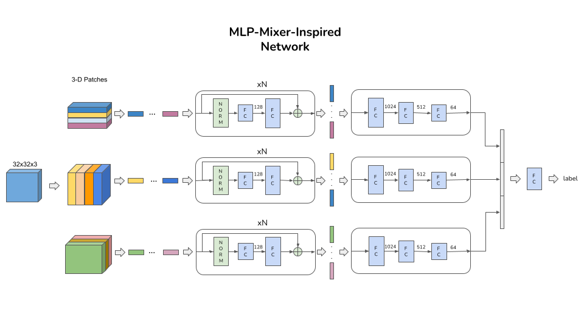

# MLP-Mixer-CIFAR10
MLP-Mixer architectures for classifying CIFAR10 images

This repo contains a re-implementation of the MLP-Mixer model
and another MLP-Mixer-inspired model to classify CIFAR-10 images.
Both pre-trained and trained models are provided. 



Two main files are provided:

1. main_cifar10.py for training both models from scratch;
2. main_tiny_imagenet.py for pre-training both models on TinyImageNet (200 classes - 500 images/class)
and then fine-tuning on CIFAR-10.


Steps:

1. Download the TinyImageNet dataset:

```
wget http://cs231n.stanford.edu/tiny-imagenet-200.zip
unzip tiny-imagenet-200.zip
```

2. Run one of the two main files:

```
python3 main_cifar10.py
```

```
python3 main_tiny_imagenet.py
```

Results:

|                               |   Mixer-MLP   | Mixer-MLP-Inspired | 
|             :---:             |     :---:     |        :---:       |
|            From scratch       |    57.54 %    |      64.48 %       |
|  Pre-trained on TinyImageNet  |    68.36 %    |      56.87 %       |


Optional parameters can be provided as input (e.g., batch_size, depth, n_epochs, ...).
Open the main files for the complete list of allowed input parameters.

To download both results and pre-trained models:

```
mkdir Results
cd Results
curl -L https://www.dropbox.com/sh/rycvh295g6975dd/AADCN1vYImM7gYdc5_omKjH7a?dl=0 >> Results.zip
unzip Results
rm Results.zip
```

TODO: parameters fine-tuning; solve over-fitting.
